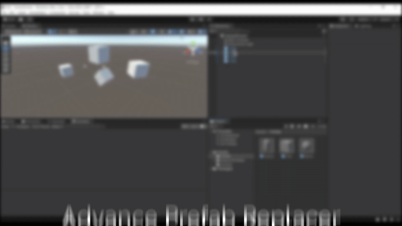

# Advanced Prefab Replacer (Unity Editor Tool)

## Overview
This Unity Editor tool allows you to replace prefab instances in your scene quickly and safely.
You can either:
- Use a *custom window* with advanced options (position/rotation/scale preserve, layer, etc.)
- Or use a *right-click context menu* in the Hierarchy for fast single-instance replacement.

No additional packages required. Pure Editor utility.

---

## Installation
1. Drag the ReplacePrefabsTool folder into your Unity project.
2. Make sure it stays inside Assets/ and the scripts stay under an Editor/ folder.

---

## How to Use

### Option 1: Right-click Replace (Quick)

1. Select the desired prefab in the Project window.
2. In the Scene Hierarchy, right-click a prefab instance.
3. Click *"Replace With Selected Prefab"*
4. The object will be replaced with the selected prefab while preserving transform and hierarchy.

### Option 2: Window Tool (Advanced)

1. Go to *Tools > Advanced Prefab Replacer*
2. Set:
   - Source prefab instance (scene object)
   - Target prefab (project asset)
3. Choose options:
   - Keep Position / Rotation / Scale
   - Preserve Layer & Parent
4. Click “Replace”

---
## 🔥 Live Demo

## Features
- Undo supported
- Works with nested prefabs
- Right-click integration
- Option to preserve transform data and hierarchy
- Works in Unity 2020.3 and above

---

## Known Issues
- Only works with prefab instances in the current scene
- Does not support replacing across multiple scenes (planned feature)

---

## Credits
Created by **Aditya Buradkar**

Follow for more tools and updates.

---

## Contact / Support
GitHub: https://github.com/adityaburadkar/AdvancedPrefabReplacer
